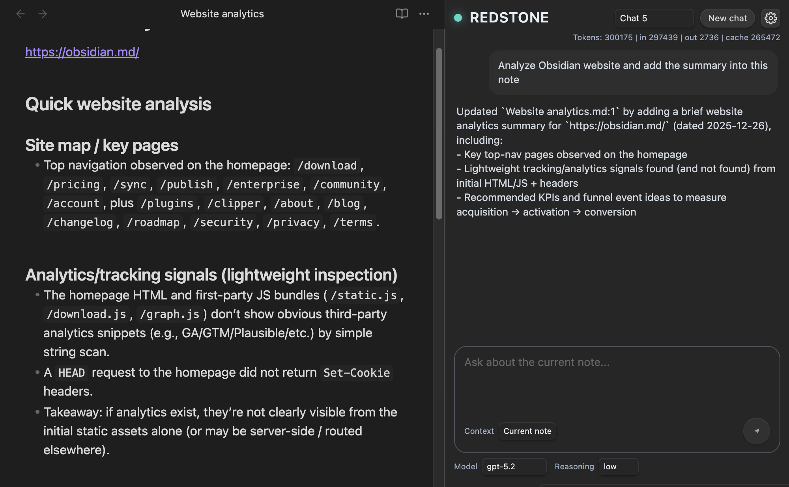

<div align="center">

<!-- TODO: Replace with a real logo if/when you have one -->
<!--  -->

# Redstone Copilot

**A modern, convenient Codex-powered AI-copilot sidebar for Obsidian.**

<!-- Badges (release number comes from GitHub Releases) -->
[](https://github.com/madAsket/obsidian-codex/releases)
[](https://github.com/madAsket/obsidian-codex/releases)
[](./LICENSE)

</div>

> [!NOTE]
> This plugin is powered by the **Codex CLI**. It uses your **global Codex installation and auth**.

---

## Redstone Copilot



### Features
- Chat with Codex to answer questions or create/edit notes in your vault.
- Use Codex models and Reasoning GPT models like GPT-5.2
- No API Key needed. Sign in with ChatGPT via email.
- Choose context:
  - Use **only the current note**, or
  - Use the **whole vault** as context.
- Create multiple chats and switch between them (each chat keeps its own history).

---

## Why Codex CLI is great (and why this plugin builds on it)

- **No API Key needed. Sign in with ChatGPT.** — Signing into your ChatGPT account to use Codex as part of your Plus, Pro, Team, Edu, or Enterprise plan. [Learn what’s included in your ChatGPT plan.](https://help.openai.com/en/articles/11369540-codex-in-chatgpt)

- **Chat history built-in** — Codex manages conversation threads and can resume them across sessions.

- **Directory-aware by design** — Make summaries, reports, and more for all the notes in your vault. Codex is built to work inside a project folder, so it can reason over files in your vault.

---

## MVP limitations

> [!WARNING]
> **Global Codex CLI only.** This plugin currently works with your **globally installed** `@openai/codex` and its global auth/config.
> **Desktop-only:** macOS and Linux are supported. Windows and mobile are not supported in the current release.

## Installation

### 1) Install Codex CLI (global)

```bash
npm install -g @openai/codex
```

[More info about Codex CLI & other methods of installation.](https://developers.openai.com/codex/cli/)

### 2) Sign in once (terminal)

Run Codex in your terminal and follow the prompts:

```bash
codex
```

### 3) Enable the plugin in Obsidian

- Open **Settings → Community plugins**
- Enable this plugin
- Open the Redstone sidebar from the ribbon icon (left toolbar).

If Codex is missing or you are not logged in, the sidebar shows a short message with a **Retry** button - follow the instruction and press **Retry**.

---

## AGENTS.md (vault instructions)

This plugin creates an `AGENTS.md` file in your **vault root**.
- It contains baseline instructions so Codex understands it’s working inside an Obsidian vault.
- Basically, everything works right out of the box, but you can **freely edit** `AGENTS.md` to add your own rules and conventions.

### Optional: Why you should edit it

Different vaults have different conventions:
- Zettelkasten vs PARA vs project-based vaults
- Frontmatter schemas
- Tagging rules
- Folder structures
- Templates

Add instructions like:
- Where new notes should be created
- How to name files
- What frontmatter fields are required
- What style/format you want for summaries

> [!TIP]
> Treat `AGENTS.md` as your “vault handbook” for AI.

---

## Settings

- **Model and reasoning level** (applies immediately).
- **Internet access** (optional, off by default).
- **Web search requests** (only available when Internet access is on).

---

## Support

- Questions / ideas: **GitHub Discussions**: https://github.com/madAsket/obsidian-codex/discussions
- Bug reports: **GitHub Issues**: https://github.com/madAsket/obsidian-codex/issues

---

## Buy me a coffee

If this plugin saves you time, please support me and further development:

<a href="https://buymeacoffee.com/madasket" target="_blank">
  
</a>

---

## Disclaimer

This is an independent community plugin and is not affiliated with Obsidian or OpenAI.

